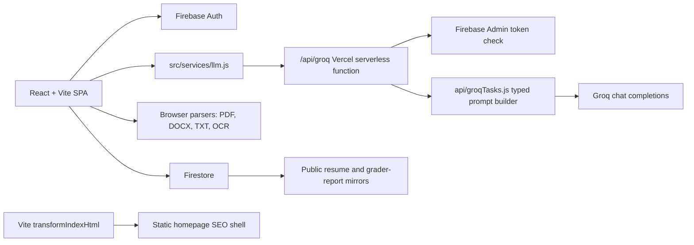

# ResuMe

<p align="center">
  <strong>Free resumes. No download ransom.</strong>
</p>

<h3 align="center">
  Live: <a href="https://resume.ayuslh.in/">resume.ayuslh.in</a>
</h3>

<p align="center">
  <a href="https://resume.ayuslh.in/templates">Templates</a>
  |
  <a href="https://resume.ayuslh.in/grader-info">ATS grader</a>
  |
  <a href="https://resume.ayuslh.in/pricing">$0 pricing</a>
</p>

<p align="center">
  
</p>

<p align="center">
  <strong>No more resume paywalls.</strong><br />
  Build the resume, grade it, rewrite weak bullets, export it, and move on with your life.
</p>

<p align="center">
  If this helps, a star helps others find the free option first.
</p>

<p align="center">
  
  
  
  
  
</p>

## Why This Exists

Built for students and early-career job seekers who shouldn't have to pay to apply for jobs. ResuMe keeps the builder, grader, rewrites, share links, and exports in one free ATS-focused workspace.

## What ResuMe Does

| Feature | Why it matters |
| --- | --- |
| AI resume builder | Turns rough notes, a resume, a brag sheet, or pasted experience into a structured resume draft for a target role. |
| ATS resume grader | Scores a resume against a job, then breaks down formatting, keywords, impact, clarity, and job match. |
| Weak bullet rewriter | Finds vague bullets and generates stronger versions without drifting away from the original facts. |
| Inline resume editor | Edit directly on the resume preview instead of fighting disconnected forms. |
| Public share links | Publish resumes and grader reports so feedback can move outside the current browser. |
| Cover letter generator | Generate a tailored cover letter from an existing resume and job description. |
| Free export | Download the finished resume without a watermark or subscription trap. |

## Templates

Pick the format that fits the role. Keep it readable. Keep it ATS-safe.

| Minimal | Modern | Professional | Creative |
| --- | --- | --- | --- |
|  |  |  |  |

## The Flow

1. Tell ResuMe the role you are targeting.
2. Paste the job description if you have one.
3. Upload or paste your brag sheet, old resume, notes, or LinkedIn-style export.
4. Choose a template.
5. Generate a resume draft.
6. Edit inline, rescan with the ATS grader, rewrite weak bullets, and export.

The grader also works as a standalone tool: paste a shared ResuMe link, paste raw resume text, or upload a file, then compare the result against one target role and up to two alternate roles.

## Architecture



- **Frontend:** React and Vite handle public pages, authenticated workspace routes, and fullscreen export/cover-letter flows.
- **API layer:** `/api/groq` is a Vercel serverless function that verifies Firebase tokens, rate-limits requests, builds typed prompts, and calls Groq server-side.
- **Data layer:** Firestore stores private resumes plus public mirrors for shared resumes and grader reports.
- **Security basics:** the app sanitizes resume HTML and uses Firestore rules for user-owned data.

## Tech Stack

- **Frontend:** React 19, Vite, React Router
- **Styling:** Tailwind CSS, PostCSS, custom CSS variables
- **Auth/data:** Firebase Auth, Firestore, Firebase Admin
- **AI:** Groq `llama-3.1-8b-instant` through Vercel serverless functions
- **Parsing/export:** `pdfjs-dist`, `mammoth`, `tesseract.js`, `docx`, browser print/PDF export
- **UX:** `lucide-react`, inline content editing, keyboard shortcuts, public/private route shells

## Run It Locally

```bash
git clone https://github.com/ayuslharora/resume-builder.git
cd resume-builder
npm install
```

Create `.env`:

```env
VITE_FIREBASE_API_KEY=your_firebase_api_key_here
VITE_FIREBASE_AUTH_DOMAIN=your_firebase_auth_domain_here
VITE_FIREBASE_PROJECT_ID=your_firebase_project_id_here
VITE_FIREBASE_STORAGE_BUCKET=your_firebase_storage_bucket_here
VITE_FIREBASE_MESSAGING_SENDER_ID=your_firebase_messaging_sender_id_here
VITE_FIREBASE_APP_ID=your_firebase_app_id_here

GROQ_API_KEYS=your_server_side_groq_key_here
```

Run the Vercel API and Vite app in two terminals:

```bash
npm run api
```

```bash
npm run dev
```

Open `http://localhost:5173`.

## Testing

```bash
npm run lint
npm run build
node --test src/**/*.test.js api/*.test.js
```

The Node test suite covers route metadata, public discovery files, Firestore rule expectations, resume persistence, sharing, HTML sanitization, parser-adjacent helpers, dashboard/builder/grader behavior, and the `/api/groq` task/security contract.

## Deploy

Vercel is the intended deploy target.

1. Import the repo into Vercel.
2. Add the Firebase `VITE_*` variables.
3. Add `GROQ_API_KEYS` as a server-side environment variable.
4. Redeploy.

The app uses `vercel.json` to route SPA paths back to `index.html`, while `/api/groq` stays available as the serverless AI endpoint.

## License

ResuMe is released under the MIT License. See [LICENSE](LICENSE) for the full license text.
