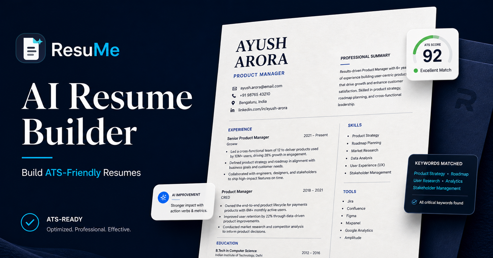
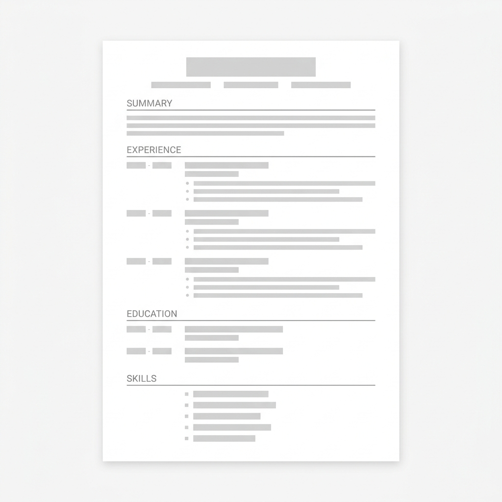
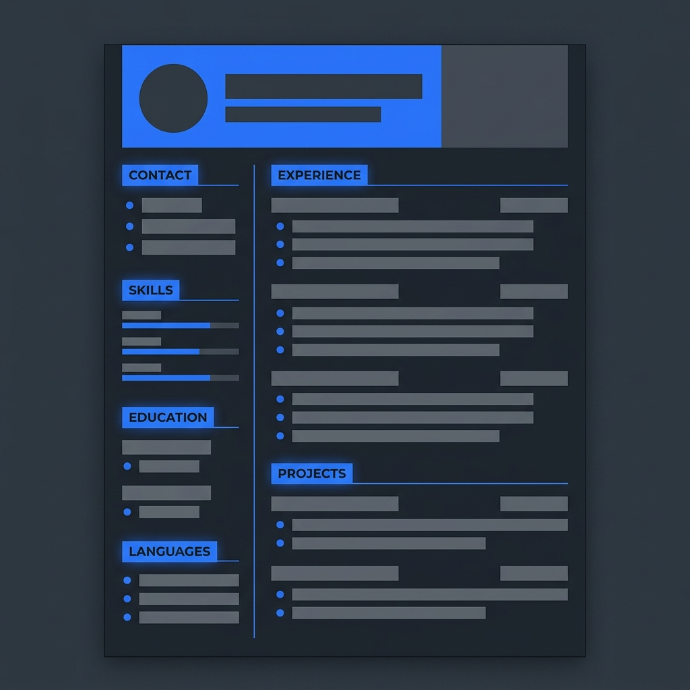
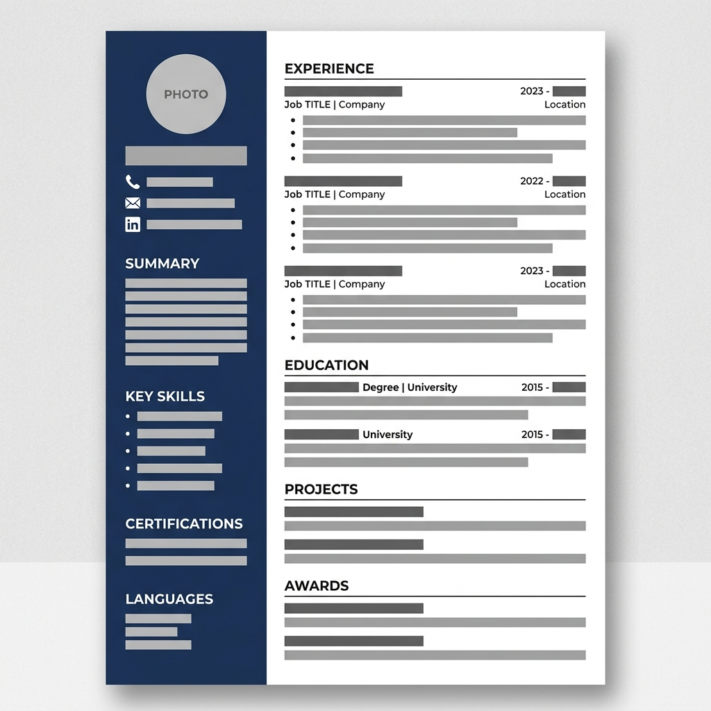
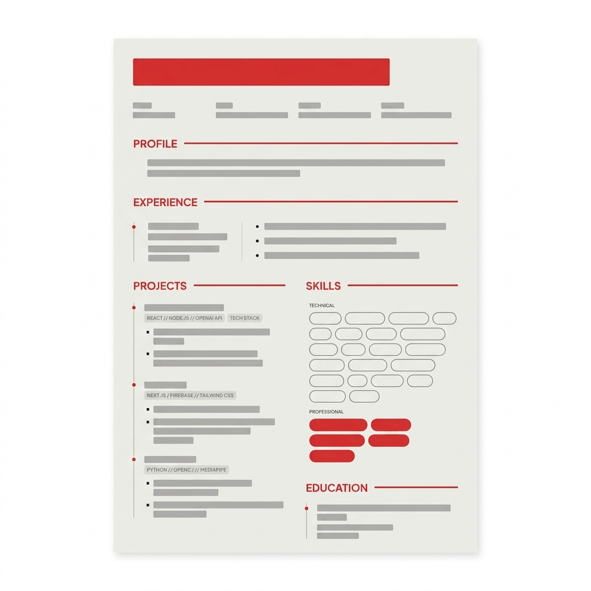

# ResuMe

<p align="center">
  
</p>

<p align="center">
  <strong>F*ck resume paywalls.</strong><br />
  Build the resume, grade it, rewrite weak bullets, export it, and move on with your life.
</p>

<p align="center">
  <a href="https://resume.ayuslh.in/">Live app</a>
  |
  <a href="https://resume.ayuslh.in/templates">Templates</a>
  |
  <a href="https://resume.ayuslh.in/grader-info">ATS grader</a>
  |
  <a href="https://resume.ayuslh.in/pricing">$0 pricing</a>
</p>

<p align="center">
  
  
  
  
  
</p>

> If this saves one job seeker from building a whole resume just to hit a download paywall, the repo has done its job. Star it so more people find the free option first.

## Why This Exists

Most resume builders let you spend an hour polishing a draft, then punch you in the face with:

- Paywalls at download
- Watermarks on your own PDF
- Monthly subscriptions for a one-time task
- "Premium" templates that should have been free
- Generic AI advice that sounds like it never read your resume

ResuMe is the counterpunch: a free, ATS-focused resume workspace that lets you build, grade, rewrite, publish, and export without the usual nonsense.

## What ResuMe Does

| Feature | Why it matters |
| --- | --- |
| AI resume builder | Turns rough notes, a resume, a brag sheet, or pasted experience into a structured resume draft for a target role. |
| ATS resume grader | Scores a resume against a job, then breaks down formatting, keywords, impact, clarity, and job match. |
| Weak bullet rewriter | Finds vague bullets and generates stronger versions without drifting away from the original facts. |
| OCR-backed parsing | Reads `PDF`, `DOCX`, and `TXT`; scanned PDFs get OCR fallback instead of failing silently. |
| Inline editor | Edit directly on the resume preview instead of fighting disconnected forms. |
| Public resume links | Publish a share link, copy it, and track views from the dashboard. |
| Shareable grader reports | Copy a report link so feedback can be shared outside the current browser. |
| PDF and DOCX export | Download the finished resume without a watermark or subscription trap. |
| Cover letter generator | Generate a tailored cover letter from an existing resume and job description. |

## Templates

Pick the format that fits the role. Keep it readable. Keep it ATS-safe.

| Minimal | Modern | Professional | Creative |
| --- | --- | --- | --- |
|  |  |  |  |

## The Flow

1. Tell ResuMe the role you are targeting.
2. Paste the job description if you have one.
3. Upload or paste your brag sheet, old resume, notes, or LinkedIn-style export.
4. Choose a template.
5. Generate a resume draft.
6. Edit inline, rescan with the ATS grader, rewrite weak bullets, and export.

The grader also works as a standalone tool: paste a shared ResuMe link, paste raw resume text, or upload a file, then compare the result against one target role and up to two alternate roles.

## Built Like A Real Product

This is not a pretty form wrapped around a single prompt.

- **Authenticated AI backend:** the browser sends typed tasks to `/api/groq`; prompts and Groq keys stay server-side.
- **Rate limiting:** AI tasks are rate-limited per user and task type.
- **Firebase Auth:** email/password and Google sign-in.
- **Firestore persistence:** private resumes, public share mirrors, grader reports, profile docs, and view records.
- **Public sharing:** `/shared/:token` for resumes and `/grader/report/:reportToken` for grader reports.
- **SEO shell:** the homepage has a build-time static shell from `src/seo/homepageSeoContent.js`, plus `robots.txt`, `sitemap.xml`, and `llms.txt`.
- **Safety rails:** resume HTML sanitization, structured task validation, Firestore rules, and focused Node tests.

## Tech Stack

- **Frontend:** React 19, Vite, React Router
- **Styling:** Tailwind CSS, PostCSS, custom CSS variables
- **Auth/data:** Firebase Auth, Firestore, Firebase Admin
- **AI:** Groq `llama-3.1-8b-instant` through Vercel serverless functions
- **Parsing/export:** `pdfjs-dist`, `mammoth`, `tesseract.js`, `docx`, browser print/PDF export
- **UX:** `lucide-react`, inline content editing, keyboard shortcuts, public/private route shells

## Run It Locally

```bash
git clone https://github.com/ayuslharora/resume-builder.git
cd resume-builder
npm install
```

Create `.env`:

```env
VITE_FIREBASE_API_KEY=your_firebase_api_key_here
VITE_FIREBASE_AUTH_DOMAIN=your_firebase_auth_domain_here
VITE_FIREBASE_PROJECT_ID=your_firebase_project_id_here
VITE_FIREBASE_STORAGE_BUCKET=your_firebase_storage_bucket_here
VITE_FIREBASE_MESSAGING_SENDER_ID=your_firebase_messaging_sender_id_here
VITE_FIREBASE_APP_ID=your_firebase_app_id_here

GROQ_API_KEYS=your_server_side_groq_key_here
```

Run the Vercel API and Vite app in two terminals:

```bash
npm run api
```

```bash
npm run dev
```

Open `http://localhost:5173`.

## Useful Commands

```bash
npm run lint
npm run build
node --test src/**/*.test.js api/*.test.js
```

## Deploy

Vercel is the intended deploy target.

1. Import the repo into Vercel.
2. Add the Firebase `VITE_*` variables.
3. Add `GROQ_API_KEYS` as a server-side environment variable.
4. Redeploy.

The app uses `vercel.json` to route SPA paths back to `index.html`, while `/api/groq` stays available as the serverless AI endpoint.

## Star The Free Option

Resume tooling should not be a trap. If you agree, star the repo and help push the free, no-watermark, no-subscription option above the paywall clones.

## License

Open source and free to use.
